# Project 2: SVD & PCA
- Christopher Stoll
- Michael Crouse

## Singular Value Decomposition (SVD)
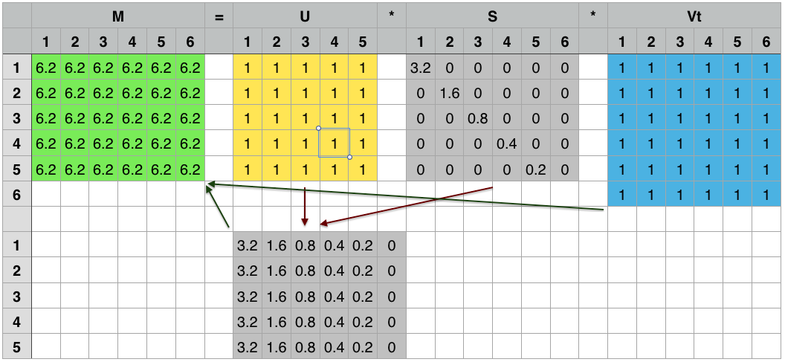

## Singular Value Decomposition (SVD)
- Implementation
  - C++ with Eigen library
  - Python with Numpy

## SVD for Image Compression
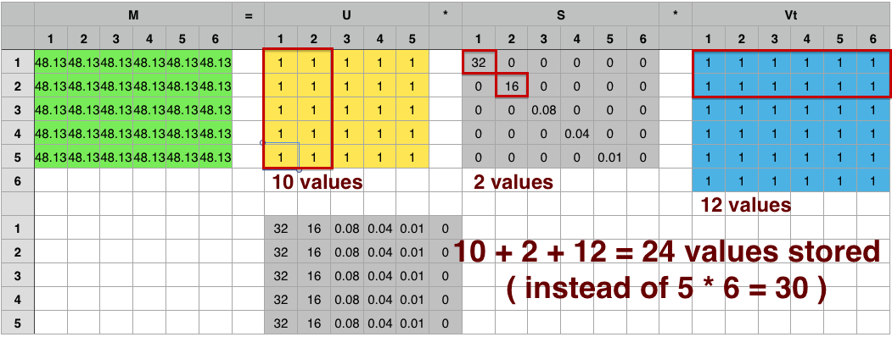

## SVD for Image Compression -- Issues
- PGM Pixel -- byte
- SVD Eigenvalues -- 8 byte double
- SVD Eigenvector values -- 2 byte float

## SVD for Image Compression -- Issues
### "Compressed" image LARGER than uncompressed
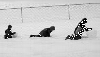

## SVD for Image Compression -- Example 1
### The first eigenvalue
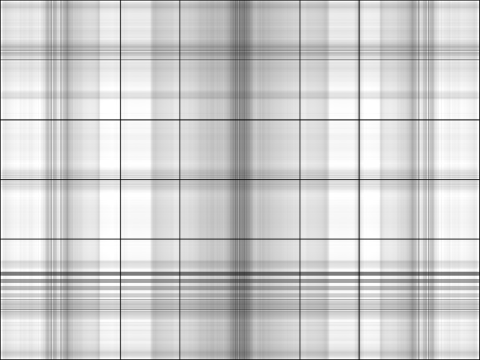

## SVD for Image Compression -- Example 1
### The second eigenvalue
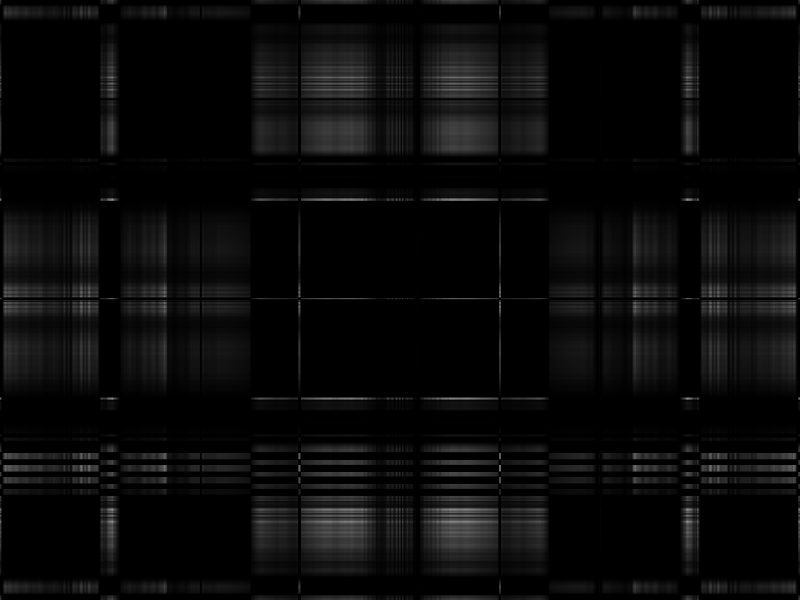

## SVD for Image Compression -- Example 1
### The third eigenvalue
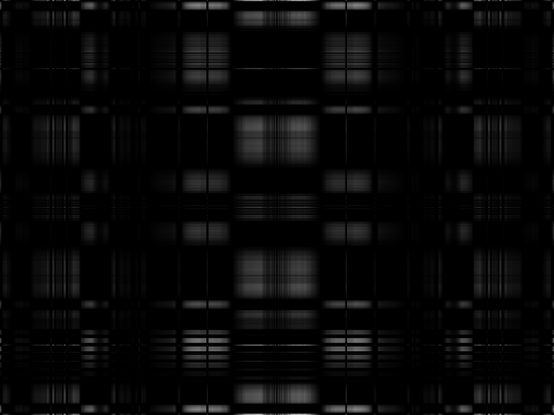

## SVD for Image Compression -- Example 1
### The first 4 eigenvalues combined
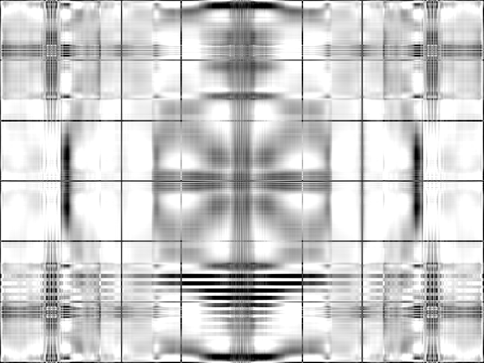

## SVD for Image Compression -- Example 1
### The first 16 eigenvalues combined
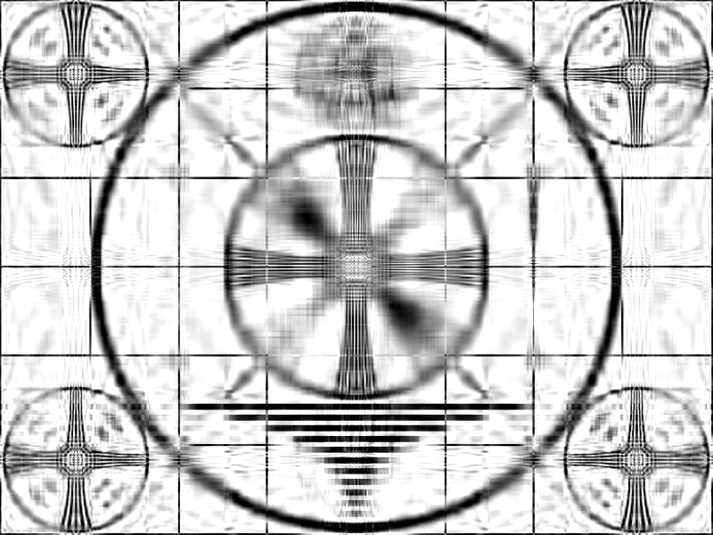

## SVD for Image Compression -- Example 1
### The first 64 eigenvalues combined
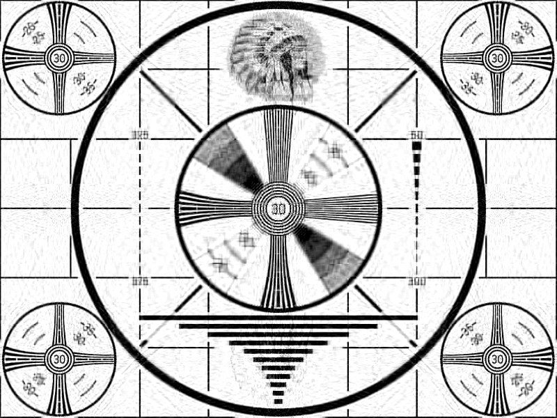

## SVD for Image Compression -- Example 1
### The original image
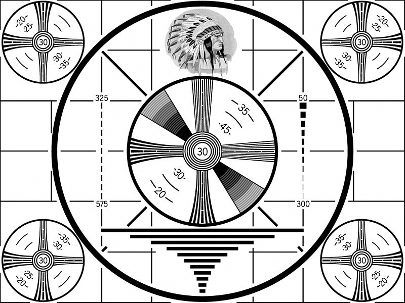

## SVD for Image Compression -- Example 2
### The first eigenvalue

## SVD for Image Compression -- Example 2
### The first 2 eigenvalues combined

## SVD for Image Compression -- Example 2
### The first 3 eigenvalues combined

## SVD for Image Compression -- Example 2
### The original image

## SVD for Image Compression
### Example 1
- 800x600
- k > **256** to be indistinguishable from original

### Example 2
- 672x504
- k >= **3** to be indistinguishable from original

## SVD on High Contrast Images
- With B&W most of the white comes from the top eigenvalues
- Can take advantage of this to reduce artifacts
- Scale each eigenvector by a factor of k

## SVD on High Contrast Images
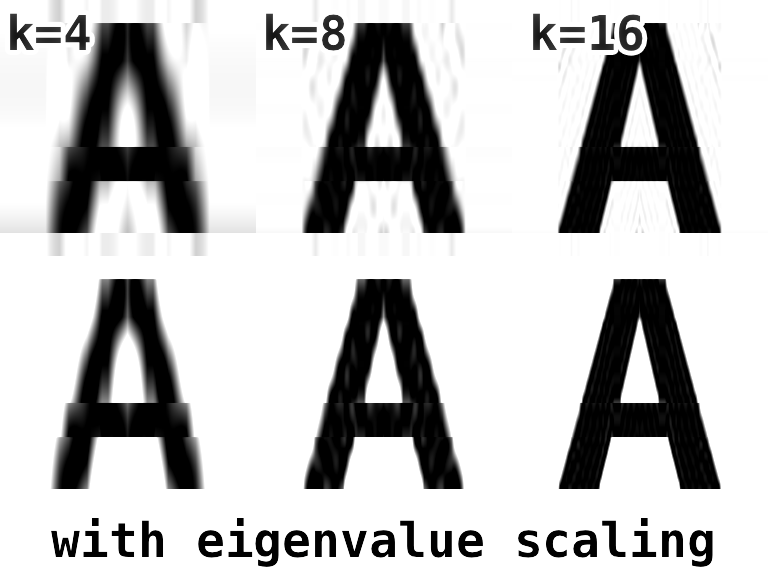

## Empirical Results

|                  | Size    | Original | Binary | Cmprs Rate | Cmprs Size | Cmprs Rate |
| ---------------- | ------- | -------- | ------ | ---------- | ---------- | ---------- |
| image.pgm        | 200x115 |      88K |    22K |        75% |        19K |        14% |
| IMG_2208.pgm     | 400x300 |     423K |   117K |        72% |        41K |        65% |
| IMG_2208-cut.pgm | 400x300 |     429K |   117K |        73% |        41K |        65% |

## Principal Component Analysis
- With SVD k=1 is the principal component
- Use SVD on data to determine the principal components
  - removes redundant information

## Data Set One
### Barberton Police Records
- March 2002 - February 2011
- People involved in incidents
  - Demographic information
  - Count of involvement types

## PCA with Weka

|          | V1      | V2      |                         | V1      | V1      |
| -------- | ------- | ------- | ----------------------- | ------- | ------- |
| dobYear  |  0.3871 |  0.144  | gender=0.0              | -0.4351 | -0.2022 |
| height   |  0.3255 | -0.0718 | gender=M                |  0.2065 | -0.2858 |
| race=0.0 | -0.4333 | -0.2112 | gender=F                |  0.045  |  0.411  |
| race=W   |  0.3543 |  0.3232 | gender=U                |  0.001  | -0.0101 |
| race=U   | -0.0002 | -0.0166 | medicalCount            |  0.0608 |  0.015  |
| race=B   |  0.0139 | -0.1981 | offenseCount            |  0.1162 |  0.0374 |
| race=A   | -0.0069 | -0.007  | warrantCount            |  0.2222 | -0.4074 |
| race=K   |  0.0004 | -0.0244 | lastWarrantBail         |  0.1677 | -0.324  |
| race=M   | -0.0064 | -0.0028 | involveCountVictim      |  0.0433 | -0.0072 |
| race=L   | -0.0001 | -0.02   | involveCountSuspect     |  0.194  | -0.2922 |
| race=I   | -0.0004 | -0.0066 | involveCountArrestee    |  0.2391 | -0.3668 |
| race=P   | -0.003  | -0.0095 | involveCountComplainant |  0.0725 |  0.0149 |
| race=N   | -0.002  | -0.0056 |                         |         |         |

## PCA with Weka
- In the first principal component `race=B` is `0.0139` whereas `race=W` is `0.3543`
  - The ratio is about .039
  - The B/W population ratio is about .065
- In the first principal component `gender=M` is `0.2065` whereas `gender=F` is `0.045`
- Notes
  - `dobYear` and `height` are over represented by 0 values (unknown)
  - `race=0.0` means race is not recorded, often the victim

## PCA with Weka
### PC 1 vs Race
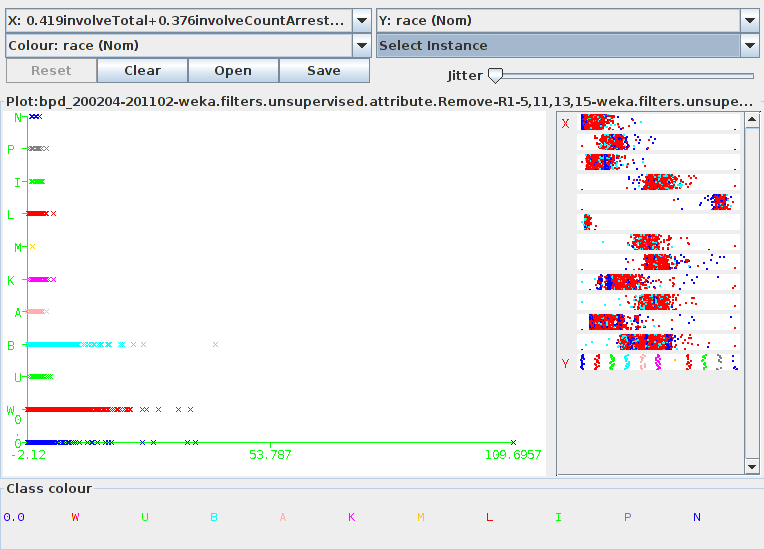

## PCA with Weka
### PC 1 vs Gender
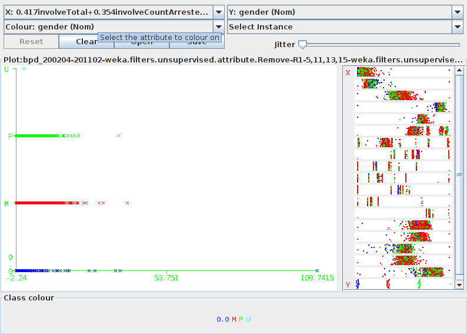

## PCA with Weka
### PC 1 vs Total Involvement
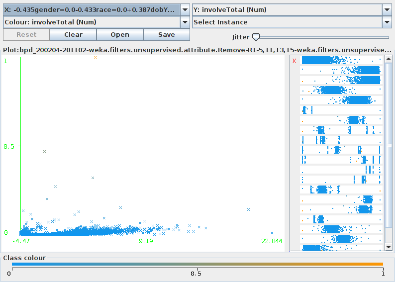

